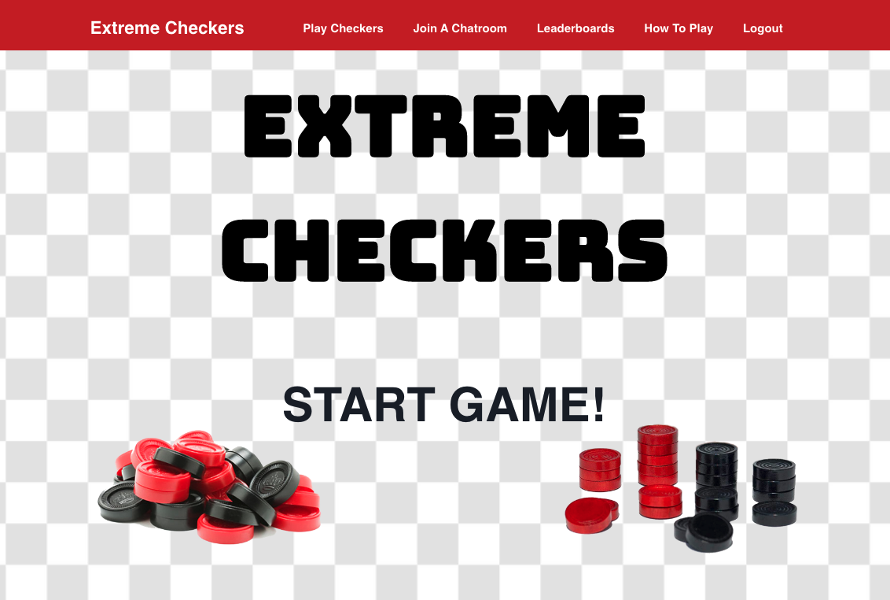
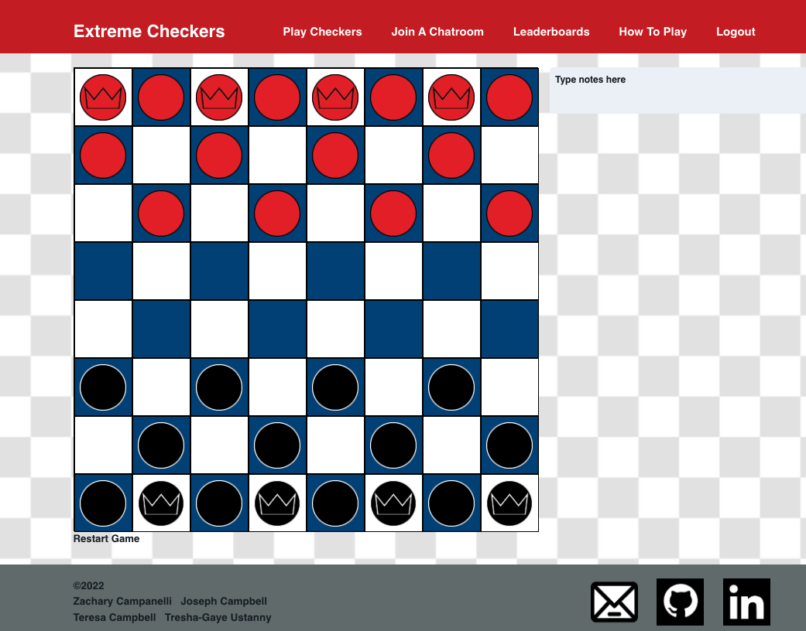
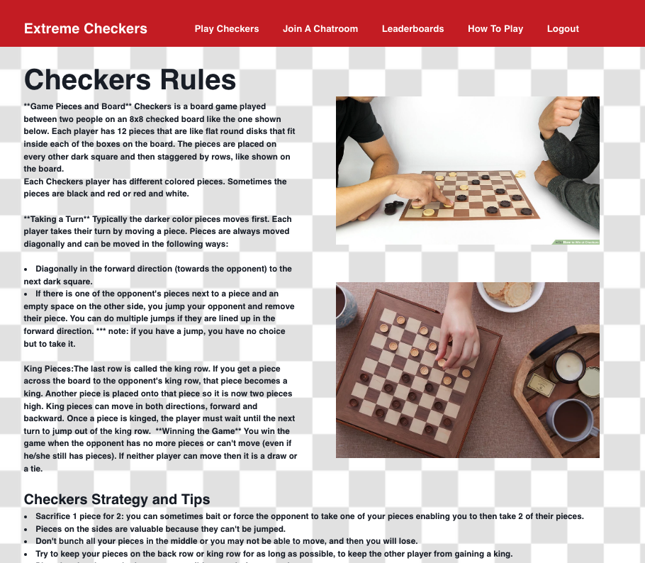

# Extreme Checkers

## Description

A MERN Stack application which allows the user to learn to play checkers as well as practice the game

## Table of Contents

- [Installation](#Installation)
- [Usage](#Usage)
- [License](#License)
- [Contributing](#Contributing)
- [Future Developments](#Future-Developments)
- [Technologies Used](#Technologies-Used)
- [Reference](#Reference)
- [Questions](#Questions)

## Installation

Clone this repository to your computer. Navigate to the root folder then run `npm init` or `npm init -y`. Then run either `npm i` or `npm install` to install the local dependencies, which will also do so in the subdirectories `client` and `server`. Next, navigate into the `server` subdirectory and locate the file `.env_sample`. Modify its contents as specified, then save and rename the file so it is called `.env`. 

## Usage
From the root folder, run the command `npm start`. Also check out the deployed application on heroku with the link below.

  
  
  

## License

A short and simple permissive license with conditions only requiring preservation of copyright and license notices. Licensed works, modifications, and larger works may be distributed under different terms and without source code.

## Contributing

Anyone is able to contribute to our project.

1. Fork the project on GitHub
2. Add your modified files to Git
   `git add path/to/filename.ext`
   OR:
   `git add .`
3. Commit your changes using a descriptive commit message.
   `git commit -m "Brief Description of Commit"`
4. Push your commits to your GitHub Fork:
   `git push -u origin branch-name`
5. Submit a pull request.

## Future Developments 

- Game Logic
- Payment for custom pieces with Stripe
- Use socket.io to allow for playing the game using two computers
- Video Chat Functionality
- Chat Rooms

## Technologies Used
- The MERN Stack (Mongoose, Express.js, React.js, Node.js)
- Faker
- Bcrypt
- Dotenv
- Graphql and Apollo Client
- Chakra-UI
- JWT-Decode
- Typescript
- PWA (service workers, webpack)

## References

React.js using Typescript tutorial on making a board game(Chess Game) -
[Frontend Coding](https://www.youtube.com/watch?v=Iri__zwxwHg&list=PLBmRxydnERkysOgOS917Ojc_-uisgb8Aj&index=1)
[Sticky Notes](https://www.youtube.com/watch?v=Efo7nIUF2JY)
[Create Progressive Web App With Heroku](https://create-react-app.dev/docs/making-a-progressive-web-app/)

## Questions

If you have any questions, concerns, or comments, feel free to contact us:

-GitHub: [Zacharycampanelli](https://github.com/Zacharycampanelli)  
-GitHub: [tcampbell01](https://github.com/tcampbell01)  
-GitHub: [JMCampbell2021](https://github.com/JMCampbell2021)  
-GitHub: [Tresha-Gaye](https://github.com/Tresha-Gaye)

## Link to Deployed Application

-[Heroku](https://extreme-checkers-app.herokuapp.com/)
